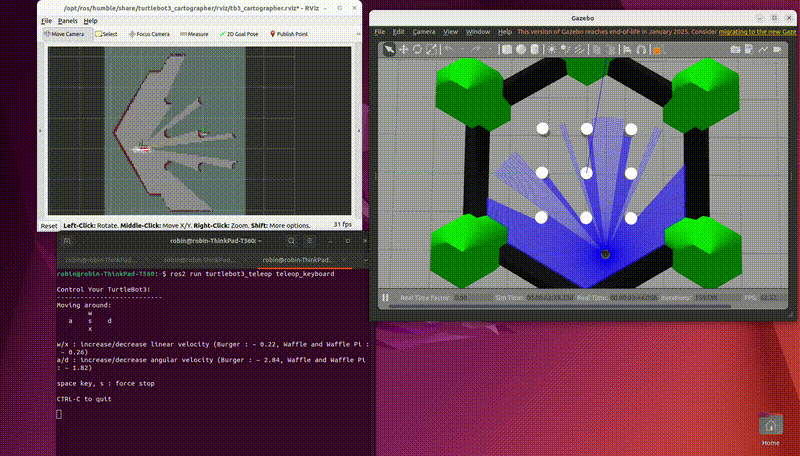
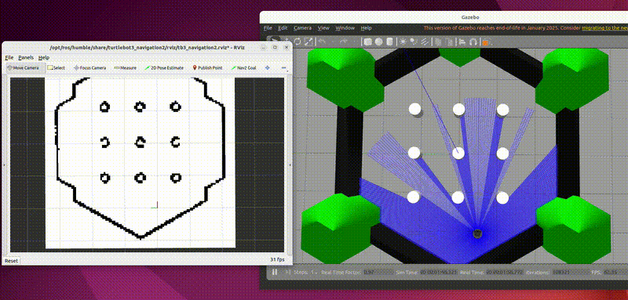

# Autonomous Navigation with ROS2 (TurtleBot3)

## Overview

This project demonstrates a complete autonomous navigation pipeline using ROS2 and TurtleBot3 in simulation.

The robot is capable of:

* Building a map using SLAM
* Localizing itself within the map
* Planning a path to a target
* Navigating autonomously in a simulated environment

---

## Tech Stack

* ROS2 (Humble)
* TurtleBot3 (Mobile Robot Platform)
* Gazebo (Simulation)
* Cartographer (SLAM)
* Nav2 (Autonomous Navigation)

---

## Prerequisites

* Ubuntu 22.04
* ROS2 Humble installed

---

## How to Run

### 1. Set TurtleBot model

```bash
export TURTLEBOT3_MODEL=burger
```

---

### 2. Start simulation

```bash
ros2 launch turtlebot3_gazebo turtlebot3_world.launch.py
```

---

## Mapping (SLAM)

### 3. Run SLAM

```bash
ros2 launch turtlebot3_cartographer cartographer.launch.py use_sim_time:=true
```

### 4. Drive the robot

```bash
ros2 run turtlebot3_teleop teleop_keyboard
```

Controls:

* `w` → forward
* `a / d` → rotate
* `x` → stop

### 5. Save map

```bash
ros2 run nav2_map_server map_saver_cli -f ~/map
```

---

## Autonomous Navigation

### 6. Launch navigation

```bash
ros2 launch turtlebot3_navigation2 navigation2.launch.py use_sim_time:=true map:=$HOME/map.yaml
```

### 7. Set initial pose

In RViz:

* Click **"2D Pose Estimate"**
* Set the robot position and orientation

### 8. Send navigation goal

In RViz:

* Click **"Nav2 Goal"**
* Select a target location

---

## Result

The robot autonomously plans and follows a path to a user-defined goal using a previously generated map.

---

## Project Highlights

* Full SLAM → Navigation pipeline implemented
* Real-time mapping using Lidar data
* Autonomous goal-based navigation
* Built and tested in a ROS2 simulation environment

---

## Demo

### SLAM



### Autonomous Navigation



---

## Future Improvements

* Dynamic obstacle avoidance tuning
* Deployment on a real robot
* Custom ROS2 nodes for extended functionality
